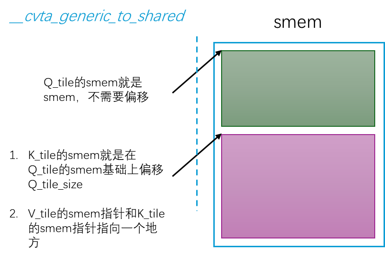

# Ref
1. [关于FlashAttention的学习笔记](https://blog.csdn.net/qq_71640350/article/details/148556347?spm=1001.2014.3001.5501)
2. [使用具有纯 MMA PTX 的 Tensor Core 编写 FlashAttention](https://github.com/xlite-dev/LeetCUDA/tree/main/kernels/flash-attn)
3. [源码](https://github.com/Dao-AILab/flash-attention)
4. [deepwiki](https://deepwiki.com/Dao-AILab/flash-attention)
5. [手撕flash_atten2](https://zhuanlan.zhihu.com/p/670085985)
6. [学习代码实现-放在我的GitHub上](https://github.com/Chosen-David/CUDA-Triton-Learn)

# FlashAttention回顾

这里主要关注QKV的矩阵乘部分：

为了避免后续还要拿c00冗余计算，所以算出c00的一瞬间就拿它与V的一行进行相乘，后面不断累加可以得到结果R矩阵该行的真实值。


# 总览


# flash_fwd_launch_template.h
## run_mha_fwd - 前向传播调度

## run_flash_bwd - 反向传播调度
### 入口函数

```cpp
template<typename Kernel_traits, bool Is_dropout, bool Is_causal>
void run_flash_bwd(Flash_bwd_params &params, cudaStream_t stream) {
#ifndef FLASHATTENTION_DISABLE_BACKWARD
    run_flash_bwd_seqk_parallel<Kernel_traits, Is_dropout, Is_causal>(params, stream);
#endif
}
```

### run_flash_bwd_seqk_parallel

```cpp
template<typename Kernel_traits, bool Is_dropout, bool Is_causal>
void run_flash_bwd_seqk_parallel(Flash_bwd_params &params, cudaStream_t stream) {
    const int num_m_block = (params.seqlen_q + Kernel_traits::kBlockM - 1) / Kernel_traits::kBlockM;
    dim3 grid_m(num_m_block, params.b, params.h);
    const int num_n_block = (params.seqlen_k + Kernel_traits::kBlockN - 1) / Kernel_traits::kBlockN;
    int gridDimx = num_n_block;
    if (params.deterministic) {
        int num_sm = get_num_sm(get_current_device());
        gridDimx = (num_sm + params.b * params.h - 1) / (params.b * params.h);
    }
    dim3 grid_n(gridDimx, params.b, params.h);

    if (!params.deterministic) {
        flash_bwd_dot_do_o_kernel<true, Kernel_traits><<<grid_m, Kernel_traits::kNThreads, 0, stream>>>(params);
    } else {
        flash_bwd_dot_do_o_kernel<false, Kernel_traits><<<grid_m, Kernel_traits::kNThreads, 0, stream>>>(params);
    }
    C10_CUDA_KERNEL_LAUNCH_CHECK();

    // We want to specialize to is_even_MN and not just is_even_M, since in the case where N is not
    // a multiple of kBlockN, we'll need to apply mask in the loop.
    const bool is_even_MN = params.cu_seqlens_q == nullptr && params.cu_seqlens_k == nullptr && params.seqlen_q % Kernel_traits::kBlockM == 0 && params.seqlen_k % Kernel_traits::kBlockN == 0;
    const bool is_even_K = params.d == Kernel_traits::kHeadDim;
    constexpr int smem_size_dq_dk_dv = Kernel_traits::kSmemSize1colblock;
    // printf("smem_size_dq_dk_dv = %d\n", smem_size_dq_dk_dv);
    BOOL_SWITCH(is_even_MN, IsEvenMNConst, [&] {
        EVENK_SWITCH(is_even_K, IsEvenKConst, [&] {
            LOCAL_SWITCH((params.window_size_left >= 0 || params.window_size_right >= 0) && !params.is_causal, Is_local, [&] {
                ALIBI_SWITCH(params.alibi_slopes_ptr != nullptr, Has_alibi, [&] {
                    SOFTCAP_SWITCH(params.softcap > 0.0, Is_softcap, [&] {
                        // If not IsEvenKConst, we also set IsEvenMNConst to false to reduce number of templates.
                        // If head dim > 128, set IsEvenMNConst to false to reduce number of templates
                        // If Is_local, set Is_causal to false
                        auto kernel = &flash_bwd_dq_dk_dv_loop_seqk_parallel_kernel<Kernel_traits, Is_dropout && !Is_softcap, Is_causal, Is_local && !Is_causal, Has_alibi, IsEvenMNConst && IsEvenKConst && !Is_local && !Has_alibi && Kernel_traits::kHeadDim <= 128, IsEvenKConst && !Has_alibi, Is_softcap>;
                        // auto kernel = &flash_bwd_dq_dk_dv_loop_seqk_parallel_kernel<Kernel_traits, false, Is_causal, false, false, true, true>;
                        if (smem_size_dq_dk_dv >= 48 * 1024)  {
                            C10_CUDA_CHECK(cudaFuncSetAttribute(
                                kernel, cudaFuncAttributeMaxDynamicSharedMemorySize, smem_size_dq_dk_dv));
                        }
                        kernel<<<grid_n, Kernel_traits::kNThreads, smem_size_dq_dk_dv, stream>>>(params);
                        C10_CUDA_KERNEL_LAUNCH_CHECK();
                    });
                });
            });
        });
    });

    auto kernel_dq = &flash_bwd_convert_dq_kernel<Kernel_traits>;
    if (Kernel_traits::kSmemdQSize >= 48 * 1024)  {
        C10_CUDA_CHECK(cudaFuncSetAttribute(
            kernel_dq, cudaFuncAttributeMaxDynamicSharedMemorySize, Kernel_traits::kSmemdQSize));
    }
    kernel_dq<<<grid_m, Kernel_traits::kNThreads, Kernel_traits::kSmemdQSize, stream>>>(params, !params.deterministic ? 1 : gridDimx);
    C10_CUDA_KERNEL_LAUNCH_CHECK();
}
```

# flash_attn_mma_share_kv

[该部分代码](https://github.com/xlite-dev/LeetCUDA/blob/main/kernels/flash-attn/mma/basic/flash_attn_mma_share_kv.cu)实现了使用 Tensor Cores 和 MMA PTX 指令从底层实现的 FlashAttention-2 算法。

## 输入与启动

输入QKV的维度 [B, H, N, d]：
B = batch size
H = num_heads (QKV_head)
N = 序列长度 （QKV_seqlen）
d = head_dim (kHeadDim)

其中：
```cpp
__launch_bounds__(WARP_SIZE *kMmaTileSeqLenQ *kMmaTileSeqLenK)
```
用于限制最大的WARP排布

启动时：
```cpp
grid(div_ceil(QKV_seqlen, Br), QKV_batch * QKV_head)
```
block.y把head和batch维度合并到一起了因此后面需要 
```cpp
  const int QKV_batch_id = blockIdx.y / QKV_head; // Batch size
  const int QKV_head_id = blockIdx.y % QKV_head;  // Head num
  const int Q_tile_id = blockIdx.x;               // Q tile_id, range [0, Tr]
  const int O_tile_id = Q_tile_id;                // O tile_id, same as Q.
```
来进行解读出来

## gmem上
首先需要找到gmem_ptr，然后取相应的数据到smem中。更具体的，以Q为例，让每个Block负责Q的一个tile，继续划分到每个chunk负责tile中的一行。注意Q是四维的，所以应该需要全局内存的偏移。我画了一个示意图：


### 对于全局偏移

也正是因为有batch和head这两个维度，因此计算全局偏移时候需要：
```cpp
  const int Q_gmem_offset =
      ((QKV_batch_id * QKV_head * QKV_seqlen * kHeadDim) +
       (QKV_head_id * QKV_seqlen * kHeadDim)); // Q [seqlen,d]
  const int K_gmem_offset =
      ((QKV_batch_id * QKV_head * QKV_seqlen * kHeadDim) +
       (QKV_head_id * QKV_seqlen * kHeadDim)); // K [seqlen,d]
  const int V_gmem_offset = Q_gmem_offset;     // V [seqlen,d]
  const int O_gmem_offset = Q_gmem_offset;     // O [seqlen,d]

```


### 对于Block内部的搬运组


kNumThreads 代表每个 thread block 使用的线程总数，理论上每(kNumThreads / Br))作为一个搬运组（我一般称之为chunk）搬运Q的一行，这样每个搬运组负责kHeadDim/(kNumThreads/Br)个数据，每个线程负责 (kHeadDim / (kNumThreads / Br))个数据：
```cpp
  // Mapping Q gmem -> tid -> smem, Q[Br,d]=[64,64 or 128], 128 threads.
  int load_smem_Q_Br = (tid / (kNumThreads / Br)); // Br 64, tid / 2, row 0~64
  int load_smem_Q_d =
      (tid % (kNumThreads / Br)) *
      (kHeadDim / (kNumThreads / Br)); // (tid % 2) * 32, 0,32,...
  // Mapping K gmem -> tid -> smem, K[Bc,d]=[64 or 128,64], 128 threads.
  int load_smem_K_Bc = (tid / (kNumThreads / Bc)); // Bc 64, tid / 2, row 0~64
  int load_smem_K_d =
      (tid % (kNumThreads / Bc)) *
      (kHeadDim / (kNumThreads / Bc)); // (tid % 2) * 32, 0,32,...
  // Mapping V gmem -> tid -> smem, V[Bc,d]=[64,64 or 128], 128 threads.
  int load_smem_V_Bc = (tid / (kNumThreads / Bc)); // Bc 64, tid / 2, row 0~64
  int load_smem_V_d =
      (tid % (kNumThreads / Bc)) *
      (kHeadDim / (kNumThreads / Bc)); // (tid % 2) * 32, 0,32,...
```
因此每个tid要搬运的位置：
行偏移：就是chunk_id，因为一个搬运组搬运一行所以你会看到：
```cpp
 int load_smem_Q_Br = (tid / (kNumThreads / Br))
```
列偏移，也即这个chunk里面的tid是几号队员然后算出他应该从哪里开始搬运：

```cpp
  int load_smem_Q_d =
      (tid % (kNumThreads / Br)) *
      (kHeadDim / (kNumThreads / Br)); 
```


### gmem的边界检查
```cpp
  // global Q row of current head for tile [Br,d] per block.
  int load_gmem_Q_Br = Q_tile_id * Br + load_smem_Q_Br;
  if (load_gmem_Q_Br >= QKV_seqlen)
    return;
```
你将Q分为多个Q_tile（Br * (kHeadDim + kPadQ)），然后调度Block为Br个chunk来搬运他们。因此当前搬运的gmem中的Q的行偏移就是：
```cpp
load_gmem_Q_Br = Q_tile_id * Br + load_smem_Q_Br
```
那么你当前处理到的行数不应该超过序列长度（也即N维度的大小QKV_seqlen）
```cpp
  if (load_gmem_Q_Br >= QKV_seqlen)
    return;
```

### gmem->smem的指针转换
前面我们已经知道了gmem里面的指针，现在我们继续来看需要搬进smem里面的指针

```cpp
// KV tile gmem load index starts from 0 and increments with
  // each iteration as we loop over seqlen.
  int load_gmem_K_Bc_offset = 0;
  int load_gmem_V_Bc_offset = 0;

  // Shared memory for Q,K,V, we don not need additional smem for O
  // collective store which perform via registers reuse and warp shuffle.
  extern __shared__ half smem[];
  constexpr int Q_tile_size =
      Br * (kHeadDim + kPadQ); // 64*64=4096, ~8192 bytes=8M
  constexpr int K_tile_size = Bc * (kHeadDim + kPadK); // K[Bc,d]
  constexpr int V_tile_size = Bc * (kHeadDim + kPadV); // V[Bc,d]
  half *Q_tile_smem = smem;                            // 8M/16M
  half *K_tile_smem = Q_tile_smem + Q_tile_size;       // 8M/16M
  half *V_tile_smem = K_tile_smem; // KV shared the same smem
  // NOTE: KV may shared same smem to reduce smem usage for kStage 1
  // stage 1, w shared KV smem, Br=Bc=64,    d=64:  8M+(8M) =16M, +Pad(2M) = 18M
  // stage 1, w shared KV smem, Br=Bc=128,   d=64:  16M+16M =32M, +Pad(4M) = 36M
  // stage 1, w shared KV smem, Br=Bc=64,    d=128: 16M+16M =32M, +Pad(2M) = 36M
  // stage 1, w shared KV smem, Br=Bc=64,    d=256: 32M+32M =64M, +Pad(2M) = 66M
  // stage 1, w shared KV smem, Br=64,Bc=32, d=256: 32M+16M =48M, +Pad(2M) = 50M
  // stage 1, w shared KV smem, Br=128,Bc=16,d=256: 64M+16M =80M, +Pad(2M) = 82M

  uint32_t smem_Q_base_ptr = __cvta_generic_to_shared(Q_tile_smem);
  uint32_t smem_K_base_ptr = __cvta_generic_to_shared(K_tile_smem);
  uint32_t smem_V_base_ptr = __cvta_generic_to_shared(V_tile_smem);

```

注意了，K_tile的smem指针和V_tile的一样，更具体的我做了一个图：


    
