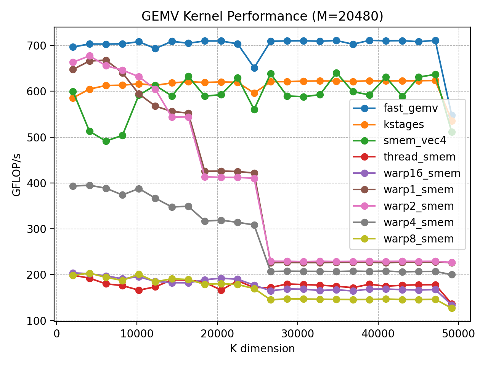

# 背景

现有的开源GEMV实现对于K维度、M维度较大的情况缺少很好的处理，本Kernel旨在解决该问题。

# 设计

主要利用Ksplit技术将K维度切分成多个K_TILE然后多缓冲加载，此外利用持久化Kernel不断取自己的下一个TILE任务进行处理，应对K维度很大的情况；

此外，加上常用的smem缓存vec，实现了即便面对M维度很大也可以高效处理的效果。

设计了一个cost model搜索器，搜索最优的k_stage、tile_K配置

# 实验

与现有的benchmark进行了对比：

# 用法

## 1) 编译（默认 sm_80，release）
make

## 2) 运行
make run

## 3) 切换不同显卡架构
make SM=90
make SM=89

## 4) 调试构建
make BUILD=debug

## 5) 清理
make clean

