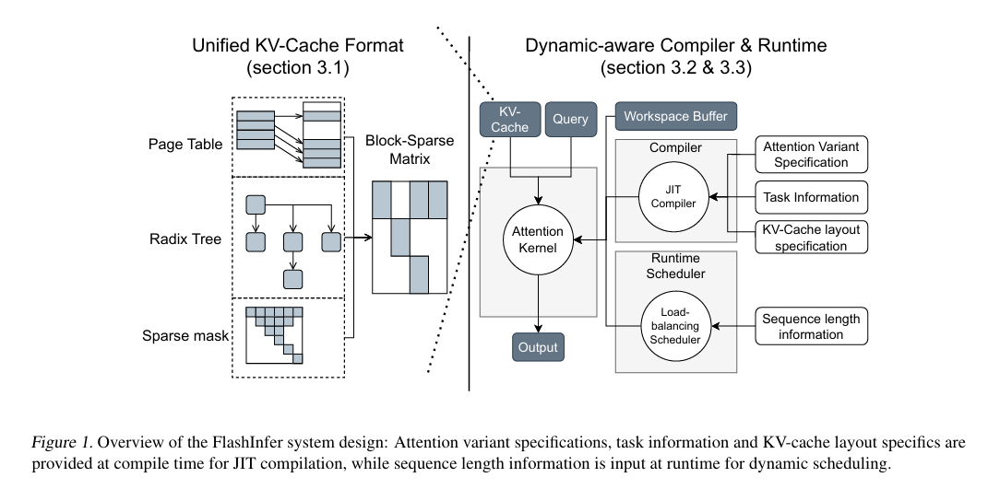

# Ref
1. [知乎](https://zhuanlan.zhihu.com/p/1904937907703243110)
2. [flashinfer 论文](https://www.arxiv.org/pdf/2501.01005)

# flashinfer

1. 块稀疏形式

>FlashInfer tackles KV-cache storage heterogeneity
>using block-sparse format and composable formats to optimize memory access and reduce redundancy

2. 定制化attention kernel

>It also offers a customizable attention template, enabling adaptation to various settings through Just-In-Time
>(JIT) compilation.

3. 负载均衡

> FlashInfer’s load-balanced scheduling algorithm adjusts to dynamism of user requests while maintaining compatibility with CUDAGraph which requires static configuration.

通过plan阶段以及负载均衡算法给CTA分配任务，之后通过持久化kernel的方法不断取任务直到run阶段完成

`Page Table / Radix Tree / Sparse Mask`：表示 FlashInfer 支持多种底层存储结构：页表（page table）、基数树（radix tree）、稀疏掩码（sparse mask）等。

`Block-Sparse Matrix`：无论底层用哪种结构，最终都可以抽象为一个 块稀疏矩阵 (block-sparse matrix)。这是 FlashInfer 的关键：用统一的 block-sparse 抽象封装各种 KV 缓存格式，便于后续高效 GPU 加载和计算。

`Dynamic-aware Compiler & Runtime`：根据 Attention Variant Specification（注意力变体定义）、Task Information、KV-Cache layout specification 生成最优的 Attention 内核代码，另外Load-balancing Scheduler，在运行时根据 Sequence length information（当前 batch 每个请求的 query 长度 / KV 长度）做任务分配（plan）。并且预分配工作区，保存 plan 阶段生成的元数据（调度信息、临时输出等），供持久化内核在 run 阶段使用。这样内核本身的 grid / block 配置可以保持静态，从而和 CUDA Graph 兼容。

